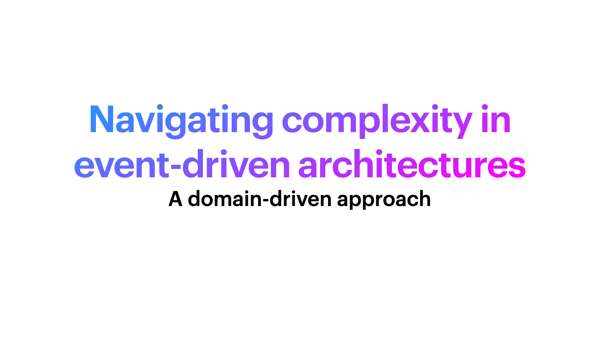

---

_Here you can find resources for the talk "Navigating complexity in event-driven architecture - A domain-driven approach"_

[If you are interested you can find my talks on my website to watch.](https://www.boyney.io/talks)

---

## Part  1: Warning signs of event-driven architecture
- It's easier now than ever to start publishing messages onto some kind of queue or event bus. But this leads to an implementation first mindset and can lead to complexity coming in event-driven architectures.
- What is a big ball of mud? This [1999 white paper dives into the details](https://www.researchgate.net/publication/2938621_Big_Ball_of_Mud).
- Warning signs of complexity include
  - Developing big balls of mud with unregulated growth, freedom of information and lack of design
  - Inconsistent conventions includes YOLO events, exposing implementation details in events and lack of standards within your architecture
  - Lack of event design means we couple our architecture through the contracts themself, we have request coupling and no version strategy.
- The warning signs and accidental complexity come into most EDA architectures I have seen, being aware of it can help, but how can you avoid it? Maybe DDD can help?
- [Talk from Peter Van Hardenberg on complexity and software (high recommened)](https://www.youtube.com/watch?v=czzAVuVz7u4)

## Part 2: How can DDD help us avoid complexity?

- Understanding strategic and tactical design
- Do some domain discovery, work with your teams to identify the highest ROI domains.
- Do domain discovery practices like [EventStorming](https://eda-visuals.boyney.io/visuals/event-storming) can help get a shared understanding and start to identify your business models and [ubiquitous language](https://martinfowler.com/bliki/UbiquitousLanguage.html). 
- Once we identify some domains we can use [core domain charts](https://github.com/ddd-crew/core-domain-charts) to highlight which are subdomains, generic and core domains.
- We can use [bounded context](https://eda-visuals.boyney.io/visuals/bounded-context-with-event-architectures) to start to encapsulate our domain models and create a boundary for our ubiquitous language. 
- We can use messages (commands, queries and events) to communicate between these boundaries.
- We can learn and explore [bounded context maps](https://github.com/ddd-crew/context-mapping) - [Great talk here to dive deeper](https://www.youtube.com/watch?v=k5i4sP9q2Lk)

## Part 3: Open source and specifications to help
- [EventCatalog](https://www.eventcatalog.dev/) - Tool I'm working on full time to help you manage complexity, come join the fun!
- DDD crew have a collection of [great GitHub repos to help you out](https://github.com/ddd-crew).
- Chris Simon has some interesting ideas and tools, thoughts around Ubiquitous language with [contextive](https://github.com/dev-cycles/contextive)
- There are a bunch of open specifications that can help you
  - [xregistry](https://xregistry.io/)
  - [OpenAPI](https://swagger.io/specification/)
  - [AsyncAPI](https://www.asyncapi.com/en)
  - [Arazzo Specification](https://github.com/OAI/Arazzo-Specification)
  - [CloudEvents](https://cloudevents.io/)
- I'm working on a project called [EventCatalog](https://www.eventcatalog.dev/) which is an open source project that helps you discover your event-driven architecture with DDD elements and features.

# Extras

## EDA Visuals

Want to learn more about EDA? Then you can [download my free book about EDA](https://eda-visuals.boyney.io/). Over 60 bite sized visuals to help you learn more about event-driven architecture.

## Books

Some great books here to dive deeper, I highly recommend.

- [Learning domain driven design](https://www.amazon.co.uk/Learning-Domain-Driven-Design-Aligning-Architecture/dp/1098100131)
- [Domain-driven design distilled](https://www.amazon.co.uk/Domain-Driven-Design-Distilled-Vaughn-Vernon/dp/0134434420/ref=sr_1_1?crid=2SDYQ2HU9FVCT&dib=eyJ2IjoiMSJ9.V38g5Do5w5nrE6OQbkJUMAQKsC9vduDhBo7FGVAo6STbdxHJVhta7MDAGiyQD-T4.PYhJjWlNIU5NOVvawxf8QoYaVjp5FHxm25WjY9jVjLs&dib_tag=se&keywords=ddd+distilled&nsdOptOutParam=true&qid=1737616686&s=books&sprefix=ddd+disille%2Cstripbooks%2C68&sr=1-1&ufe=app_do%3Aamzn1.fos.95fd378e-6299-4723-b1f1-3952ffba15af)
- [Domain driven design](https://www.amazon.co.uk/Domain-Driven-Design-Tackling-Complexity-Software/dp/0321125215/ref=sr_1_1?crid=21JBVDOBL1JRE&dib=eyJ2IjoiMSJ9.Lo7-Md3VvIV38Rzn-ytmnWB1gdph7SOcGi2QiFqOVZ1dy04lVC1YASEeDJ1cUQZnlfUfprRmmKfAFZG42k2QTJTh7MUKUtZQBHNZzK9sAxwK6wnN7gyjcfDa1vB5_pyLytSctkBm7PJpbg9jL1TDKI3I7JiXppcvlNbYKkuwEdLy16hjrm5S1uFmnKNfvkuYs2TvxrvMO1bE1n1BMnTKQyu_PYBxqDInvLA-R0_MLzI.VhemrlC6z4speiE02K08MQaqqODF4-CDsC1WHEELKPQ&dib_tag=se&keywords=ddd&nsdOptOutParam=true&qid=1737616709&s=books&sprefix=dadd%2Cstripbooks%2C64&sr=1-1&ufe=app_do%3Aamzn1.fos.95fd378e-6299-4723-b1f1-3952ffba15af)

## Useful Links

- https://en.wikipedia.org/wiki/Lehman%27s_laws_of_software_evolution

- https://medium.com/nick-tune-tech-strategy-blog/turning-domain-discovery-into-product-and-organizational-improvements-with-a-ddd-exemplar-9e759c365a9e

- https://www.thoughtworks.com/en-gb/insights/blog/architecture/domain-driven-design-in-functional-programming

- https://www.infoq.com/articles/architecture-modernization-domain-driven-discovery/

- https://leanpub.com/visualcollaborationtools

## Want more?

Want to learn more, I have a [few more talks on my website](https://www.boyney.io/talks) that can help you dive into EDA.

### Work with me

If you would like to dive deeper, and work with me, I would love to help you with your event-driven architecture, design, governance, or help implementing EventCatalog. Just reach out!

If you would like to see this talk at your event, just reach out, I would be happy too.

Thanks!
